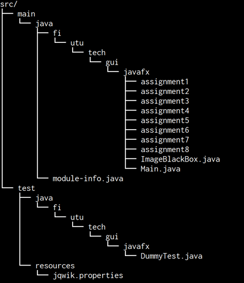

# Assignment A1

In these assignments we familiarize ourselves with basic concepts of GUI programming in JavaFX. These concepts include Stages, Scenes, Nodes and their relations with layouts and components. We take a peek into basics of event handling as well. Remember that at minimum your **application should be able to compile** for it to pass. During this assignment (A1) you should **not** use FXML nor any [WYSIWYG editors](https://en.wikipedia.org/wiki/WYSIWYG) for creating the GUI; only plain imperative Java is allowed.

## General instructions
The sub-assignments should be done in their respective folders (in the `src/main` source tree): the first assignment of A1 should be done in folder "assignment1", the second assignment of A1 in "assignment2" and so on (figure).



The assignments may depend on previous assignments (ie. if in assignment 1 we create a window and in assignment 2 we create a window with contents, you can see that it is impossible to do assignment 2 if theory of assignment 1 is not understood). 

A specific assignment to be started can be executed by giving the assignment number as a command line argument.

Using maven:

```
mvn exec:java -Dexec.args="assignmentnumber"
```

E.g. for executing assignment 3:

```
mvn exec:java -Dexec.args="3"
```

Your IDE of choice (Eclipse, VSCode, IntelliJ) has their own way of specifying command line arguments. Refer to their documentation in case you're not familiar with them.

## Assignment 1 - Getting started on JavaFX (0.5p)
During the first assignment, your task is to create a JavaFX application that opens an empty window. The assignment should be done in "MainApp1.java" in "assignment1" folder as instructed previously. Set the window title to whatever you want (but do remember that you might need to present your application to others as well). You can use "Noise" as the title for example.


## Assignment 2 - Content creation (0.5p)
The second assignment continues the work done in assignment 1. In assignment 2, instead of an empty window, you should create content for the window as well.

Create a *Label* component with your text-of-choice, use "Hello from the Scene!" if you cannot come with anything other.

*Note: Feel free to use the code of assignment1 as a basis for assignment2 but do not modify the files in assignment1 folder.*


## Assignment 3 - Layouts! (0.5p)
Create an interface according to these specifications:
- The initial size for the window should be (500x300) px
- The application window should have three components on the top of the window: 1 label ("Seed:"), 1 text field ("No seed available") and 1 button ("settings")
- The bottom of the window should contain two buttons ("Previous" and "Next")
- The center of the application should contain the "Hello from the Scene!" label
- See the screenshot for visual representation - feel free to use different symbols or text for the buttons


## Assignment 4 - Layouts for humans (0.5p)
The layout in assignment 3 is completely usable - it feels a bit amateurish though. Let's spice it up with some margins and spacing options:

- The components on the top of the window:
    - The text input field should be made "disabled", "greyed out"
    - The text input field shoud take up all the free horizontal space


## Assignment 5 - More layouts (0.5p)
- The components on the bottom
    - The buttons should have spacing around them (so that they are not directly next to each other, we are still under Corona, remember)
    - The components on the bottom should have a bottom margin so that they are not directly next to the window bottom border
    - The buttons should be centered on horizontal axis. Note that the centering should work regardless of the window size: Do **NOT** try to center the components by using labels with whitespace or any other hacks.


## Assignment 6 - Images! (0.5p)
Replace the label on the center with your image of choice


The image resource should load without any issues both when launching
with `mvn exec:java` and the resulting `jar` package from the `target/`
directory (`mvn package`).

## Assignment 7 - Event handling (0.5p)
The assigment 7 uses `ImageBlackBox` class to get images with random noise. The API for ImageBlackBox is simple: calling `next()` gives you next random noise image, calling `previous()` returns the previous image and so on. The `getCurrentSeed()` returns the current seed.

Set the buttons "Previous" and "Next" to call respective ImageBlackBox methods and replace the Image on the center with the new image on every button press. Also, update the text input box with the current image seed.


## Assignment 8 - Windows, event handling and loops (0.5p)
Create a second window in addition to the main window. The second window should contain multiple shapes (Circles, Squares...) with different colors. The shapes can be on top of each other (in Z-axis, stacked). Use loops to create the shapes. Implement this second window in `OtherWindow` class.

The second window should not be opened as soon as one starts the application: the window should be shown only when the user presses the "settings" button.


