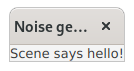
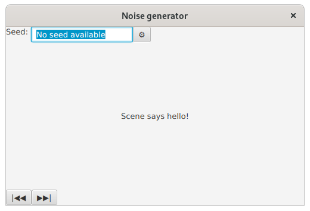
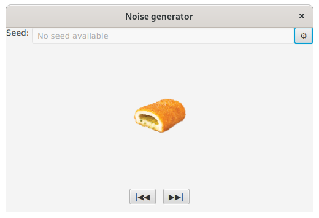
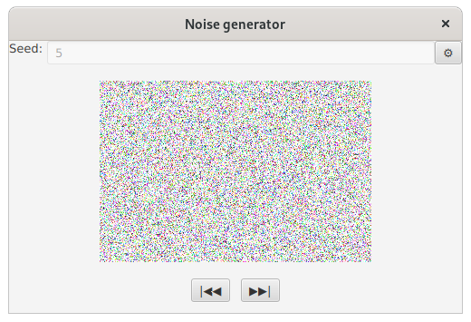

# Tehtävänanto A1

Tämän viikon tehtävissä tutustumme käyttöliittymäohjelmoinnin peruskonsepteihin JavaFX:ssä. Näitä konsepteja ovat muun muassa "Staget", "Scenet", "Nodet (solmut)" ja komponentit sekä niiden sijoittelu. Tämän lisäksi otamme pikaisen katsauksen tapahtumankäsittelyyn. Muista, että **minimissään ohjelmasi tulisi kääntyä**: kun palautat ohjelmasi, varmista, että se kääntyy. Tämän viikon tehtävissä (A1) ei tule käyttää FXML:ää tai WYSIWYG-editoreja käyttöliittymän luontiin; vain imperatiivisen Javan käyttö on sallittu.

## Yleiset ohjeet
Viikkotehtävien alakohdat tulisi tehdä niille varattuihin kansioihin (hakemistopuussa `src/main`): eli siis tämän viikon (A1) ensimmäinen harjoitus tulisi tehdä kansioon "Tehtävä1" ja toinen harjoitus kansioon "Tehtävä2" jne. (ks. kuva).


Osa tehtävistä on riippuvaisia aiempien tehtävien ymmärtämisestä. Esimerkiksi tehtävässä 1 luomme ikkunan ja tehtävässä 2 luomme ikkunan, jossa on sisältöä. Kuten huomaat, tehtävää kaksi on hieman hankala lähteä tekemään, mikäli ensimmäisen tehtävän kanssa on ollut ongelmia.

Halutun harjoitustyön pystyy käynnistämään antamalla ohjelmaa käynnistäessä komentoriviparametrina ("command line argument/parameters") tehtävänumeron. 

Maven-koontityökalua käyttäen:

```
mvn exec:java -Dexec.args="tehtävänumero"
```

Esim. jos halutaan ajaa tehtävä 3:

```
mvn exec:java -Dexec.args="3"
```

Kun käytät jotakin kehitysympäristöä, kuten Eclipseä, VSCodea tai IntelliJ:tä, on niissä jokaisessa omat tapansa antaa suoritettavalle ohjelmalle komentoriviparametrit. Nämä tavat selviävät tarkastelemalla kehitysympäristön dokumentaatiota, mikäli asia ei ole ennalta tuttu.

## Tehtävä 1 - JavaFX:n perusteet (0,5p)
Ensimmäisen tehtävän aiheena on luoda JavaFX-sovellus (Application), joka avaa tyhjän ikkunan. Kuten aiemmin selvitettiin, tehtävä tulisi tehdä `MainApp1.java`-tiedostoon, joka sijaitsee Tehtävä1-kansiossa. Aseta ikkunan otsikko haluamaksesi (muista kuitenkin, että saatat joutua julkisesti esittämään ohjelmasi toimintaa). Voit käyttää otsikkona esimerkiksi "Noise generator" tämän liittyen ohjelman tulevaan toimintaan.


## Tehtävä 2 - Sisällönluonti (0,5p)
Toisessa tehtävässä jatketaan siitä, mihin ensimmäinen tehtävä jäi. Toisessa tehtävässä tyhjän ikkunan sijaan ikkunassa tulisi olla sisältönä "ohjeteksti", eli *Label* haluamallasi tekstisisällöllä. Mikäli et keksi mitään, voit käyttää tekstinä esimerkiksi "Moikka täältä scenestä!".

*Huomaa: Voit vapaasti käyttää hyväksi tehtävässä 1 tekemääsi koodia, mutta älä silti muokkaa Tehtävä1-kansiossa olevaa koodia toisia töitä varten, vaan tee jokainen tehtävä aina omaan kansioonsa tehtävänannon mukaisesti.*




## Tehtävä 3 - Komponenttien sijoittelu! (0,5p)
Luo käyttöliittymä seuraavien vaatimusten mukaisesti:
- Ikkunan aloituskoko tulisi olla (500x300)px
- Ikkunan yläosassa tulisi olla kolme komponenttia: 1 ohjeteksti (label), 1 tekstilaatikko (text field) tekstillä "No seed available" ja 1 painike ("Asetuksille")
- Ikkunan alaosassa tulisi olla kaksi painiketta ("Edellinen" ja "Seuraava")
- Keskellä tulisi olla aiemmin tekemäsi "Hello from the Scene!" tai vastaava ohjeteksti
- Voit katsoa mallia kuvakaappauksesta. Saat vapaasti valita tekstit painikkeille, ei ole pakko käyttää samoja symboleita.




## Tehtävä 4 - Sijoittelua ihmisiä varten (0,5p)
Tehtävän 3 komponenttisijoittelu on ihan toimiva, mutta siinä on hieman amatöörimäinen tunnelma. Sijoitellaan komponentteja hieman mielikuvituksellisemmin käyttäen marginaaleja ja välimatka-asetuksia (spacing):

- Komponentit ikkunan yläosassa:
    - Tekstilaatikon tulisi olla "disabled"-tilassa, eli "harmaana ja epäaktiivisena"
    - Tekstilaatikon tulisi laajentua viemään kaikki horisontaalinen vapaa tila


## Tehtävä 5 - Lisää sijoittelua (0,5p)
- Komponentit alaosassa:
    - Painikkeilla tulisi olla välimatkaa toisiin painikkeisiin (jotta ne eivät ole ihan vieri vieressä, onhan sentään Korona-aika)
    - Painikkeiden ja ikkunan alareunan välissä tulisi olla marginaali
    - Painikkeiden tulisi olla keskitetty vaakasuunnassa. Keskityksen tulisi toimia millä ikkunakoolla tahansa, joten kannattaa unohtaa kaikki "välilyöntejä ohjeltekstissä" -viritelmät ja tehdä keskitys oikein käyttäen JavaFX:n tarjoamia metodeja


## Tehtävä 6 - Kuvia! (0,5p)
Korvaa aiemmin keskelle asettamasi ohjeteksti jollakin kuvalla



Kuvan tulisi latautua ilman virhetilanteita sekä käskyllä `mvn exec:java`
että ajettaessa `target/`-hakemistoon paketoitu projektin `jar`-tiedosto
(`mvn package`).

## Tehtävä 7 - Tapahtumankäsittelyä (0,5p)
Tehtävässä 7 käytetään mukana annettua `ImageBlackBox`-luokkaa, joka pystyy generoimaan kohinakuvia. ImageBlackBoxin API on yksinkertainen: `next()` palauttaa sinulle listassa seuraavan kohinakuvan, `previous()` palauttaa edellisen kuvan jne. Metodi `getCurrentSeed()` palauttaa tämänhetkisen kuvan siemenluvun.

Aseta "Edellinen" ja "Seuraava" painikkeet kutsumaan vastaavia ImageBlackBoxin metodeita ja korvaa joka painaisulla keskellä oleva kuva BlackBoxin palauttamalla uudella kuvalla. Päivitä myös syöttölaatikon "No seed available" -teksti nykyisen kohinakuvan siemenluvulla joka painalluksella.




## Tehtävä 8 - Ikkunoita, tapahtumankäsittelyä ja silmukoita (0,5p)
Luo toinen ikkuna pääikkunan lisäksi. Toiseen ikkunaan tulisi piirtää useita eri muotoja (ympyröitä, neliöitä...) eri väreillä. Muodot voivat olla toistensa päällä (Z-akselin suuntaisesti, eli "peittävät toisensa"). Käytä silmukoita muotojen luomiseen. Tämän toisen ikkunan koodi tulisi kirjoittaa `OtherWindow` -luokkaan.

Toista ikkunaa ei saisi avata heti ohjelmaa käynnistäessä, vaan ikkuna tulisi näyttää vasta kun käyttäjä painaa "asetukset"-painiketta.


