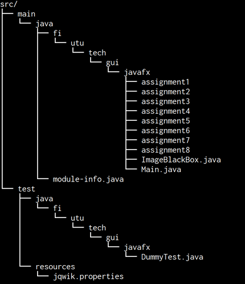
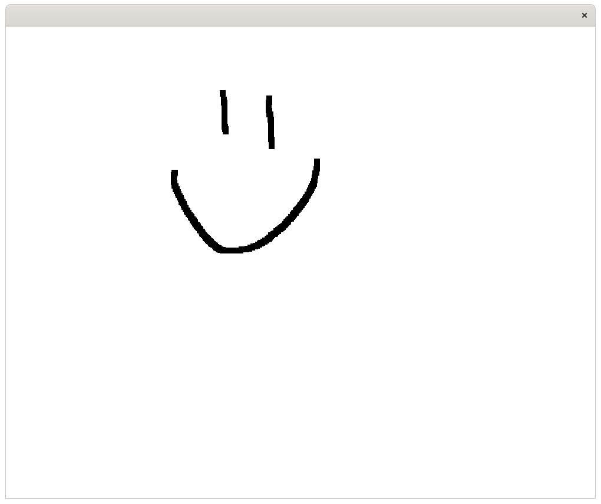
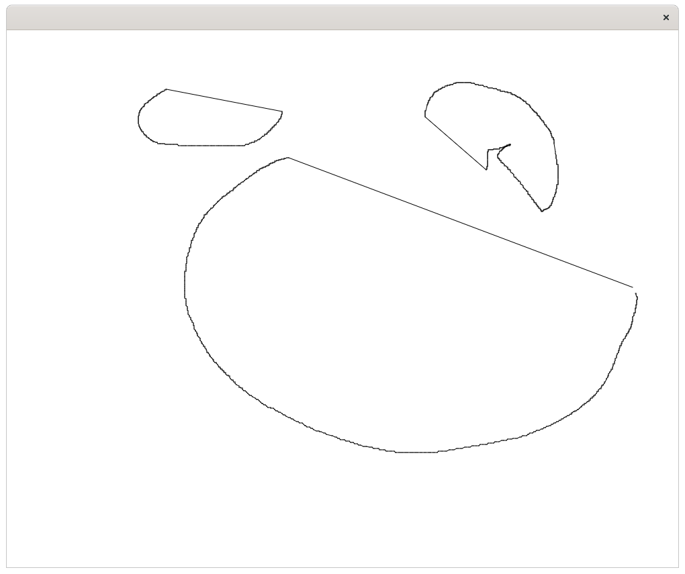
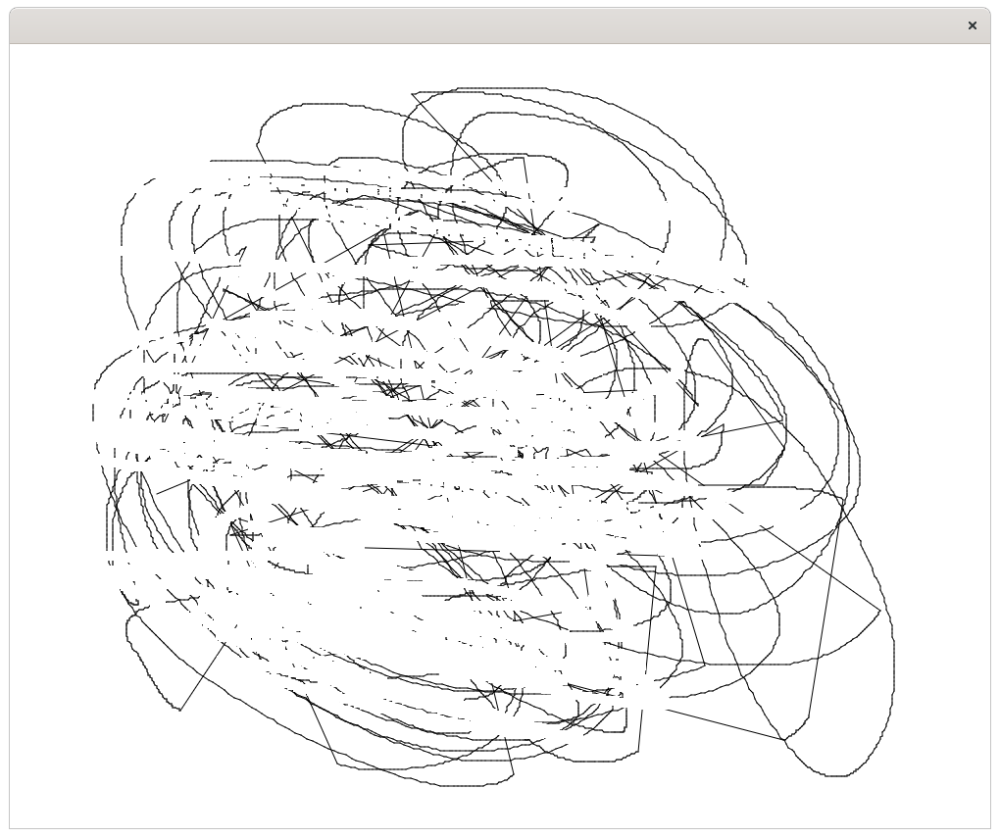
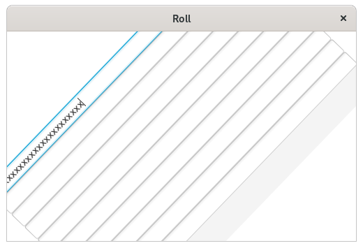
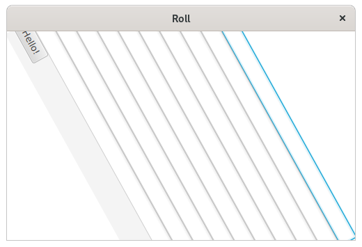
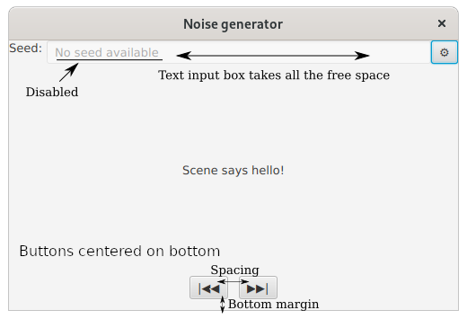
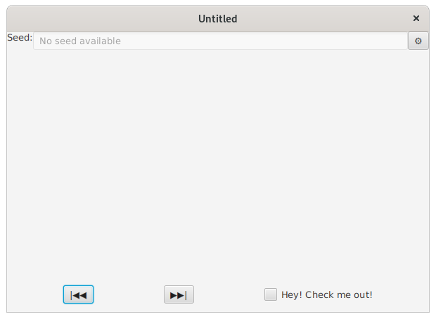
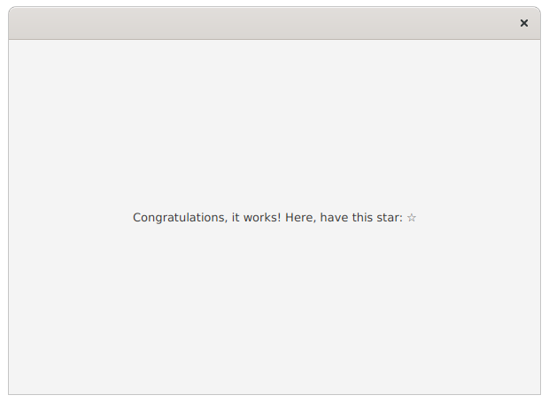

# Assignment A2

This week the focus is in event handing: registering event handlers to multiple different events, using input device state to determine the event handling functionality and understanding the sinking and bubbling phases of event dispatching. Finally, a small peek into creating graphical user interfaces declaratively and using them in your own Java program.

## General instructions
The sub-assignments should be done in their respective folders (in the src/main source tree): the first assignment of A2 should be done in folder "assignment1", the second assignment of A2 in "assignment2" and so on (figure). **Similar to the exercise last week with the image resource**, some of the files need to be located under `src/main/resources`. This is mostly to do with FXML files. More information is provided in the specific exercises.



A specific assignment to be started can be executed by giving the assignment number as a command line argument.

Using maven to compile and run:

```
mvn compile exec:java -Dexec.args="assignmentnumber"
```

E.g. for compiling and executing assignment 3:

```
mvn compile exec:java -Dexec.args="3"
```

Your IDE of choice (Eclipse, VSCode, IntelliJ) has their own way of specifying command line arguments. Refer to their documentation in case you're not familiar with them.

## Assignment 1 - A bit more complex events (0.5p)
The project template includes an application with a Canvas component. Implement "drawing" functionality to the canvas. In other words, the movement of the mouse cursor should be painted to the canvas while dragging the mouse over it.

You should only need one event handler to implement this.

*Hint: getGraphicsContext2d() and fillRect() from the GraphicsContext interface*




## Assignment 2 - Multiple event handlers (0.5p)
Let's continue where we left at the assignment 1: The drawing should work as it worked before. The only difference is that when the user stops drawing (mouse button is released), the canvas should draw a straight line from the end point to the start point of the drawn shape.



*Hint: strokeLine() from the GraphicsContext interface* 

## Assignment 3 - Refining event handing (0.5p)
Assignment 2 is used as a basis for this assignment. This time you should implement an "eraser" functionality: The secondary button of the mouse (the right side button for the right-handed people) should paint the canvas white, thus "erasing" the content under cursor. The primary button should still behave as it did on the assignment 2.

If you did not do the assignment 2, continue from assignment1.



*Hint: clearRect() from the GraphicsContext interface* 

## Assignment 4 - Event delivery process (0.5p)
Let's imagine for a while that you are working for a little bit eccentric boss in a software company. The boss has come up with an idea where your software should do a specific kind of a "roll" effect for the whole interface every time someone presses the letter 'x' on their keyboard.

The "roll method" is given in template and named `doABarrelRoll()`. You should come up with a way to be able to do the roll every time the user presses 'x', no matter which component is currently focused.




## Assignment 5 - Controlling the event delivery process (0.5p)
Your eccentric boss really dislikes the letter 'x' for some reason and has come up with a new plan to discourage the users from using it. In addition to rolling the interface, the boss has decided that the letter 'x' should not be allowed to be used in any of the UI components at all (ie. you cannot even type it into the text input box).

Implement a functionality where the letter 'x' does not reach any of the components and instead does the roll and only the roll. Also, write a bit (for example in the code comment block) that how does the key event traverse through the components in case the 'x' is allowed to go through (case in assignment 4) and in case it is not (case in this assignment).



## Assignment 6 - WYSIWYG (0.5p)
What you see is what you get. Implement the interface from the assignment A1 using *SceneBuilder*. A screenshot is provided for reference.

**NOTE:** Save the FXML file created by SceneBuilder to `src/main/resources/fi/utu/tech/gui/javafx/assignment6`. Ie. **NOT** under `src/java/...`. Use the name `NoiseGenerator.fxml`.




## Assignment 7 - Declarative GUI definition (0.5p)
SceneBuilder creates a declarative description of the UI using XML. XML, as a text-based format, is readable using any text editor (incl. Eclipse). **Copy** the FMXL file created in assignment 6 to the respective resource folder of `assignment7` as `NoiseGenerator.fxml`.

Edit this **copy** of the original file using a text editor. Add a new `CheckBox` component next to the "Previous" and "Next" buttons. Also set text of your own as the text for the CheckBox. In addition to the CheckBox, change the spacing of the bottom panel to `100`.

After the changes have been done, add XML comments above the edited parts  (`<!-- XML comment looks like this -->`) "to prove", that you have actually used text editor instead of SceneBuilder.

After editing, feel free to preview the UI using SceneBuilder. But remember not to save over the manually edited files to ensure that the comments are not overwritten. The file should open without any parsing errors!




## Assignment 8 - FXML-kuvauksen tuominen Java-maailmaan (0.5p)
There is a FXML file in `src/main/resources/fi/utu/tech/gui/javafx/assignment8/Example.fxml` provided by the template. Edit the `MainApp8.java` so that it locates, loads and finally shows the interface in `Example.fxml`.

The FXML resource should load without any issues both when launching with `mvn exec:java` and when running using the jar package in the `target/` directory (generated by `mvn package`).

*Hint: This might come in handy <https://tech.utugit.fi/soft/tools/lectures/dtek0097/declarative/fxml/#fxml-loader>*


