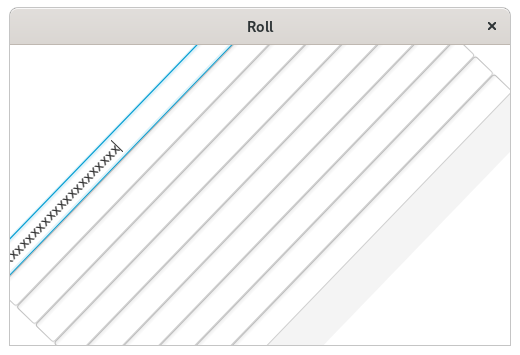
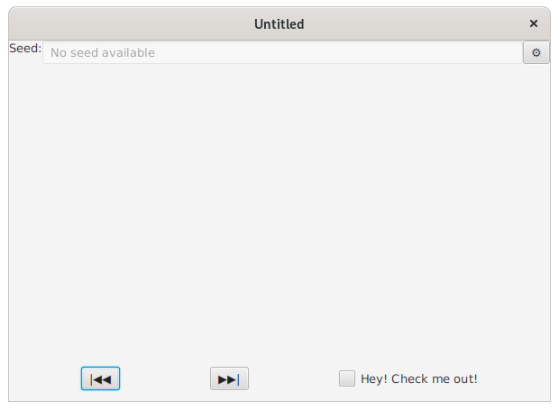

# Tehtävänanto A2

Tämän viikon tehtävissä keskitytään pääosin tapahtumankäsittelyyn: kytketään tapahtumankäsittelijöitä useisiin eri tapahtumiin, kohdennetaan tapahtumankäsittelijän toiminta vain tiettyihin syöttölaitteen painikkeisiin, sekä selvennetään upotus- ja kuplimisvaiheen tapahtumien toimintaa. Lopuksi tutustutaan käyttöliittymien luontiin deklaratiivisesti, sekä tämän deklaratiivisen käyttöliittymäkuvausen käyttämistä osana Java-ohjelmaa.

## Yleiset ohjeet
Viikkotehtävien alakohdat tulisi tehdä niille varattuihin kansioihin (hakemistopuussa `src/main`): eli siis tämän viikon (A2) ensimmäinen harjoitus tulisi tehdä kansioon "assignment1" ja toinen harjoitus kansioon "assignment2" jne. (ks. kuva). **Kuten viime viikon kuvia lataavassa harjoituksessa**, osa tehtävien tiedostoista tulee asettaa `src/main/resources`-hakemistopuun alle. Tämä koskee lähinnä FXML-tiedostoja ja tästä kerrotaan lisää kyseisten tehtävien kohdalla.


Halutun harjoitustyön pystyy käynnistämään antamalla ohjelmaa käynnistäessä komentoriviparametrina ("command line argument/parameters") tehtävänumeron. 

Maven-koontityökalua käyttäen kääntö ja ohjelman suoritus:

```
mvn compile exec:java -Dexec.args="tehtävänumero"
```

Esim. jos halutaan ajaa tehtävä 3:

```
mvn compile exec:java -Dexec.args="3"
```

Kun käytät jotakin kehitysympäristöä, kuten Eclipseä, VSCodea tai IntelliJ:tä, on niissä jokaisessa omat tapansa antaa suoritettavalle ohjelmalle komentoriviparametrinsa. Nämä tavat selviävät tarkastelemalla kehitysympäristön dokumentaatiota, mikäli asia ei ole ennalta tuttu.

## Tehtävä 1 - Monimutkaisemmat tapahtumankäsittelijät (0,5p)
Tehtäväpohjassa on mukana sovellus, jossa on piirtoalustakomponentti (Canvas). Toteuta piirtoalustaan "kynätoiminto". Toisin sanoen, kun hiirtä raahataan painike pohjassa painettuna piirtoalustan päällä, tulisi siihen piirtyä hiiren liikkeen mukaista kuviota.

Tehtävän tulisi onnistua käyttämällä vain yhtä tapahtumankäsittelijää.

*Vinkki: getGraphicsContext2d() ja GraphicsContext-rajapinnasta esim. fillRect()* 


## Tehtävä 2 - Useita tapahtumankäsittelijöitä (0,5p)
Jatketaan siitä, mihin tehtävässä 1 jäätiin: Eli piirron pitäisi edelleen toimia kuten aiemminkin. Erona tehtävään 1 on se, että kun piirto lopetetaan (hiiren painiketta lakataan painamasta), tulisi piirtää suora viiva piirron lopetuskohasta piirron aloituskohtaan.


*Vinkki: GraphicsContext-rajapinnasta strokeLine()* 

## Tehtävä 3 - Tapahtumankäsittelyn tarkentaminen (0,5p)
Jatka siitä, mihin tehtävä 2 jäi, mutta implementoi tällä kertaa hiiren kakkospainikkeeseen (oikeakätiselle oikeanpuoleinen painike) "pyyhekumi", jolla voit maalata valkoista väriä piirtoalustalle. Hiiren ykköspainikkeen tulisi edelleen toimia tehtävän 2 mukaisesti.

Mikäli et toteuttanut tehtävää 2, jatka tehtävästä 1. Tehtävää on mahdoton muuten tehdä, koska piirtoalueella ei olisi mitään pyyhittävää.


*Vinkki: GraphicsContext-rajapinnasta clearRect()* 

## Tehtävä 4 - Tapahtumankäsittelyn kulku (0,5p)
Eksentrinen projektipäällikkösi on päättänyt, että ohjelmistojenne tavaramerkkinä on ominaisuus, jossa x-kirjainta painettaessa missä tahansa päin käyttöliittymää, ohjelman käyttöliittymän tulisi tehdä "pyörähdys".

Pyörähdyksen suorittava metodi (`doABarrelRoll()`), sekä ohjelmarunko on annettu valmiina. Sinun tulee keksiä, miten pyörähdys saadaan toimimaan x-kirjainta painettaessa, vaikka ohjeman tekstilaatikko olisi valittuna, sekä implementoida tämä toiminnallisuus.




## Tehtävä 5 - Tapahtumankäsittelyn kulun ohjaaminen (0,5p)
Eksentrinen projektipäällikkönne päätti myös, ettei hän oikeastaan ollenkaan pidä x-kirjaimista tekstissä, sillä se johtaa helposti 2000-luvun alun nuorisokieleen, jossa ks-kirjainyhdistelmät korvattiin usein x-kirjaimella. Täten hän päätti, että x-kirjainta painettaessa ohjelman tulisi tehdä ainoastaan edellisessä tehtävässä kuvattu pyörähdys ja jättää x-kirjain kokonaan toimittamatta muille komponenteille: tällöin sitä ei voisi myöskään kirjoittaessa käyttää.

Toteuta em. toiminnallisuus ja mieti, miten tieto näppäinpainalluksesta kulkisi komponenttihierarkiassa ilman toimittamisen estoa (tehtävä 4:n tilanne) ja eston kanssa (tämän tehtävän tilanne).


## Tehtävä 6 - WYSIWYG (0,5p)
What you see is what you get. Toteuta tehtäväkerrasta A1 tuttu käyttöliittymä käyttäen SceneBuilder-työkalua. Alla kuvakaappaus, jota voit käyttää apuna suunnitellessasi käyttöliittymää.

**HUOM!:** Talleta SceneBuilderin tuottama FXML-tiedosto polkuun `src/main/resources/fi/utu/tech/gui/javafx/assignment6`. **Ei** siis `src/java/...` alle. Käytä nimenä `NoiseGenerator.fxml`.


## Tehtävä 7 - Deklaratiivinen käyttöliittymäkuvaus (0,5p)
SceneBuilder tuottaa XML-pohjaisen kuvauksen käyttöliittymästä. XML on luettavissa millä tahansa tekstieditorilla (esimerkiksi Eclipsellä). Kopioi tehtävässä 6 luomasi FXML-tiedosto vastaavasti `assignment7`:n resurssikansioon ja avaa tiedosto editorissa.

Muokkaa XML:ää siten, että alapalkkiin lisätään uusi CheckBox-komponentti "Edellinen" ja "Seuraava" -painikkeiden viereen. Aseta Checkboxiin myös omavalintainen tekstisi. Tämän lisäksi muuta alapalkin spacing arvoon 100.

Lisää tekemiesi muutosten yläpuolelle XML-kommentti (`<!-- XML-kommentti kirjoitetaan näin -->`) "todistaaksesi", että olet muokannut XML-tiedostoa käsin, etkä käyttänyt WYSIWYG-editoria.

Voit muokkauksen jälkeen avata työsi SceneBuilderissa esikatselleksesi tekemistäsi muutoksia. Älä kuitenkaan talleta tiedoston päälle SceneBuilderissa. Muokatun tiedoston tulisi kuitenkin avautua SceneBuilderissa eikä tuottaa jäsennysvirhettä.




## Tehtävä 8 - FXML-kuvauksen tuominen Java-maailmaan (0,5p)
Polussa `src/main/resources/fi/utu/tech/gui/javafx/assignment8/Example.fxml` on valmis SceneBuilderilla tehty FXML-määrittely. Muokkaa `MainApp8.java`-tiedostoa siten, että saat ladattua tämän FXML-tiedoston ja asetettua sen sisältämän käyttöliittymän ikkunan sisällöksi. 

*Vinkki: Tästä voi olla hyötyä: <https://tech.utugit.fi/soft/tools/lectures/dtek0097/declarative/fxml/#fxml-loader>*


